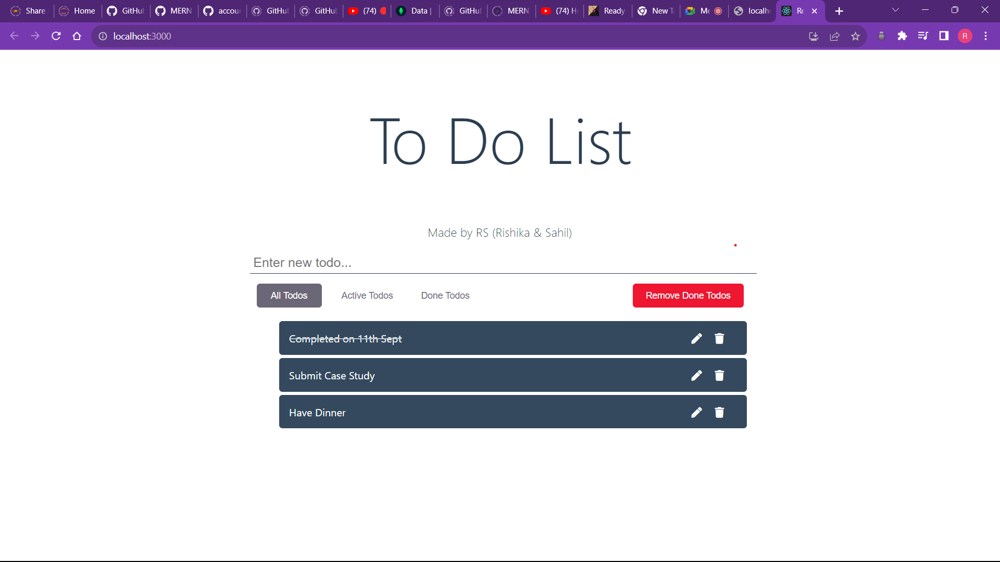

# This was created by Sahil & Rishika
# Run npm install on both the folders client and server
# Config the key.js by adding the url of you mongo db by creating a new project in mongo db and then create a user name and password of your own choice and then build a connection of app, there you will get the URL and then in that URL change the password
# Go in each folder and then run the command "npm start"
# Make the necessary to do list you want 
# Commits have been made using rishika's account since there were dependency error and incompilance in sahil's mac. 
